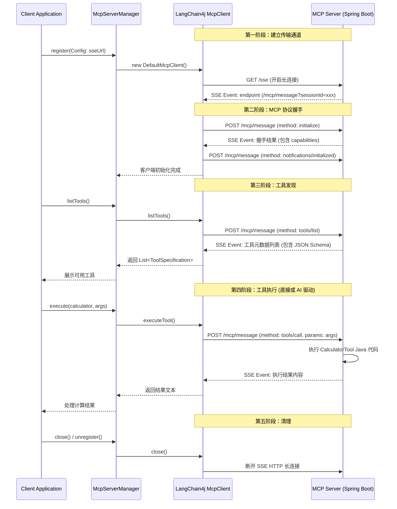

# MCP Demo 开发与探索总结文档

本文档总结了基于 `langchain4j-mcp` 客户端与官方 `mcp-spring-webmvc` 服务端实现 Model Context Protocol (MCP) Demo 的开发步骤、架构设计及交互流程。

## 1. 整体开发步骤

本项目的开发采用了标准的 C/S（客户端/服务端）架构，分为 `mcp-server` 与 `mcp-client` 两个模块。

### 1.1 服务端开发步骤 (mcp-server)

服务端的主要目标是暴露符合 MCP 协议规范的接口（HTTP+SSE），并将本地工具注册至 MCP Server，供客户端调用。

**步骤 1：引入依赖与配置解决版本冲突**
- 引入 `mcp-spring-webmvc`（MCP 官方 Java SDK）与 `spring-boot-starter-web`。
- **关键点**：MCP SDK 0.10.0 依赖 Jackson 2.19.0+，而 Spring Boot 3.4.4 默认使用 2.18.x。因此必须在 BOM 或 POM 中显式强制使用 Jackson 2.19.0，否则运行时会报 `NoSuchMethodError`。

**步骤 2：开发工具实现类 (Tools)**
工具是 MCP 服务端提供能力的核心单元。
- **`CalculatorTool`**：实现了基础的四则运算。它定义了所需的入参 Schema（`operation`, `a`, `b`），并将执行逻辑包装在 `BiFunction` 处理器中。
- **`WeatherTool`**：演示了包含可选参数与枚举约束的复杂 Schema 设计，通过模拟数据返回结构化的 JSON 天气信息。
- **作用**：这些类通过提供 `McpServerFeatures.SyncToolSpecification`，将工具的元数据（名称、描述、JSON Schema）与实际的 Java 业务逻辑桥接起来。

**步骤 3：配置与启动 MCP Server**
在 `McpServerConfig` 类中完成传输层与协议层的装配。
- **传输层配置**：注册 `WebMvcSseServerTransportProvider`，指定 POST 端点（如 `/mcp/message`）。并通过 `RouterFunction` 将 SSE（GET `/sse`）与 Message 端点注册到 Spring Web MVC 的路由体系中。
- **MCP Server 初始化**：通过 `McpServer.sync(transportProvider)` 构建同步服务器对象，配置服务器信息（`serverInfo`），声明能力（`tools(true)`），并注入前面定义的 `CalculatorTool` 与 `WeatherTool`。
- **启动入口**：常规的 Spring Boot 启动类 `McpServerApplication`。

### 1.2 客户端开发步骤 (mcp-client)

客户端的目标是连接 MCP 服务端，发现工具，并将其无缝集成到 LangChain4j 的 AI 工作流中。

**步骤 1：构建配置模型**
- **`McpServerConfig`**：一个轻量级的 Record 类型，描述连接一个 MCP 服务所需的信息（标识 Key、显示名称、SSE URL/命令行指令、超时配置）。这为管理多服务器奠定了基础。

**步骤 2：开发核心管理器 (McpServerManager)**
这是客户端架构的枢纽，负责 MCP 连接的生命周期管理。
- **连接与握手**：提供 `register()` 方法，根据配置创建 `McpClient`。在这个过程中，底层的 `DefaultMcpClient` 会自动处理与服务端的协议握手（`initialize` 请求）。
- **生命周期维护**：内部使用 `ConcurrentHashMap` 维护注册信息与客户端实例，实现连接缓存、安全卸载与容错隔离。
- **工具聚合机制**：提供 `buildToolProvider()` 方法，将所有已注册的 `McpClient` 聚合为一个 `McpToolProvider`，这是 LangChain4j 进行跨服务器工具调度的关键桥梁。

**步骤 3：开发调用演示场景**
编写 `DirectCallDemo` 与 `McpClientDemo` 展示不同的交互形态。
- **直接调用**：跳过大模型，开发者直接组装 `ToolExecutionRequest` 并通过底层 `McpClient.executeTool()` 发送请求。适用于集成测试。
- **多服务管理**：演示如何动态注册、查询、卸载多个虚拟或实体的 MCP 服务节点。
- **AI 驱动调用**：演示终极使用形态，即将聚合了多服务器能力的 `McpToolProvider` 注入到 LangChain4j 的 `AiServices` 中，大模型根据对话上下文自主决定何时调用哪个服务上的哪个工具。

---

## 2. 交互过程与多服务器管理机制

### 2.1 客户端与服务端交互时序图

MCP over HTTP 的通信模型高度依赖异步与长连接：请求走 HTTP POST，但业务响应不通过原路返回，而是通过提前建立的 SSE (Server-Sent Events) 单向长连接推回客户端。

### 2.2 客户端多 MCP 服务器管理机制

在复杂的 AI Agent 场景下，一个大模型往往需要同时利用外部的搜索服务、本地的数据库服务以及云端的文件服务，这就要求 MCP 客户端具备管理多个异构 MCP 节点的能力。

本项目通过 **`McpServerManager`** 实现了这一架构：

1. **统一注册表映射**：
   Manager 内部维护了 `Map<String, McpClient>`。每个 MCP 服务器被赋予唯一的 `Key`。无论是 HTTP/SSE 模式的远端服务，还是 Stdio 模式的本地 Python 脚本，都被抽象并缓存为统一的 `McpClient` 实例。

2. **热插拔与生命周期隔离**：
   - 客户端应用可以在运行时随时调用 `register(config)` 接入新的工具池，此时当前应用（大模型）的能力边界被动态拓展。
   - 调用 `unregister(key)` 则主动断开对应的 SSE 连接或杀死底层子进程，收缩能力边界。
   - 如果某个 MCP 服务端宕机，Manager 会在调用层面将其隔离（得益于构建 `McpToolProvider` 时开启的容错配置 `failIfOneServerFails=false`），不会影响大模型调用其他存活节点的工具。

3. **能力池聚合 (Aggregated Tool Provider)**：
   管理多服务器的核心价值在于**无缝聚合**。Manager 提供的 `buildToolProvider()` 方法将底层多个 `McpClient` 打包并向外暴露为一个单一的 `McpToolProvider`。
   - 当 LangChain4j 的大模型需要知道自己能做什么时，它向 Provider 询问，Provider 会并发查询底层所有注册节点的 `tools/list`，并将成百上千个工具规格汇总为一个大列表喂给大模型。
   - 当大模型决定调用工具 `A` 时，Provider 会根据映射路由机制，精确地将 JSON-RPC 请求分发到拥有工具 `A` 的那个特定 MCP 服务器节点。

通过这一机制，客户端应用从“硬编码连接某个服务”升级为“拥有一个可动态伸缩的外部能力池平台”。